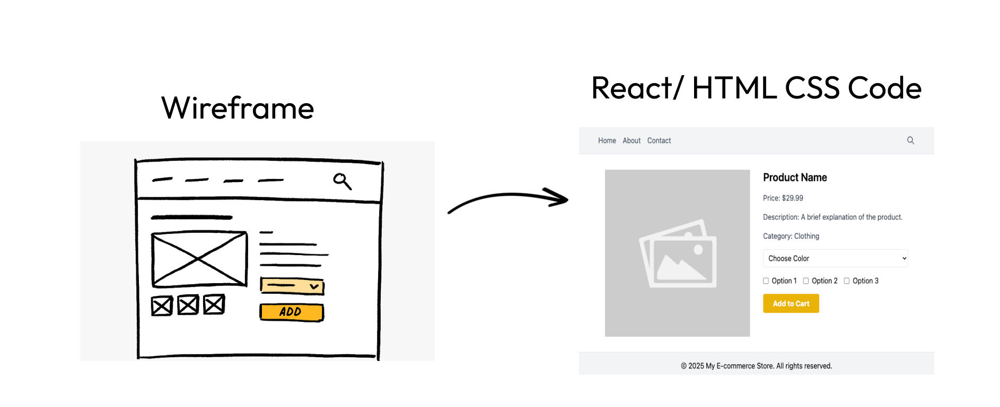

# Ai Pixel Code



## 🚀 Overview

Ai Pixel Code is an AI-powered application that transforms wireframes and design mockups into production-ready code. Using advanced AI technology, it analyzes your design images and generates clean, responsive code instantly, saving developers and designers countless hours of manual coding.

## ✨ Features

- **Instant Code Generation**: Upload a wireframe image and get production-ready code in seconds
- **Multiple Format Support**: Works with PNG, JPG, and SVG design files
- **Responsive Design**: Generated code is fully responsive and works across all device sizes
- **Component Recognition**: AI identifies UI components and recreates them accurately
- **User Authentication**: Secure login with Firebase authentication
- **Design History**: Access all your previous designs in one place
- **Dark Mode Support**: Comfortable viewing experience in any lighting condition
- **Live Preview**: See your generated code in action immediately

## 🛠️ Technologies Used

- **Frontend**: Next.js, React, TypeScript, Tailwind CSS
- **Authentication**: Firebase Auth
- **Storage**: Supabase Storage
- **AI Integration**: Custom AI model for wireframe analysis
- **UI Components**: Shadcn UI
- **State Management**: React Context API
- **Styling**: Tailwind CSS with custom theming

## 📋 Prerequisites

Before you begin, ensure you have the following installed:
- Node.js (v18 or higher)
- npm or yarn
- Firebase account (for authentication)
- Supabase account (for storage)

## 🔧 Installation

1. Clone the repository:
   ```bash
   git clone https://github.com/Ekpo-Emmanuel/wireframe-to-code.git
   cd wireframe-to-code
   ```

2. Install dependencies:
   ```bash
   npm install
   # or
   yarn install
   ```

3. Set up environment variables:
   Create a `.env.local` file in the root directory with the following variables:
   ```
   # Firebase
   NEXT_PUBLIC_FIREBASE_API_KEY=your_firebase_api_key
   NEXT_PUBLIC_FIREBASE_AUTH_DOMAIN=your_firebase_auth_domain
   NEXT_PUBLIC_FIREBASE_PROJECT_ID=your_firebase_project_id
   NEXT_PUBLIC_FIREBASE_STORAGE_BUCKET=your_firebase_storage_bucket
   NEXT_PUBLIC_FIREBASE_MESSAGING_SENDER_ID=your_firebase_messaging_sender_id
   NEXT_PUBLIC_FIREBASE_APP_ID=your_firebase_app_id

   # Supabase
   NEXT_PUBLIC_SUPABASE_URL=your_supabase_url
   NEXT_PUBLIC_SUPABASE_ANON_KEY=your_supabase_anon_key
   
   # AI Model (if applicable)
   AI_MODEL_API_KEY=your_ai_model_api_key
   ```

4. Run the development server:
   ```bash
   npm run dev
   # or
   yarn dev
   ```

5. Open [http://localhost:3000](http://localhost:3000) with your browser to see the application.

## 🖥️ Usage

1. **Sign Up/Login**: Create an account or log in using your email
2. **Create New Design**: Click the "Create New Design" button in the sidebar
3. **Upload Wireframe**: Upload your wireframe or design mockup image
4. **Add Description**: Provide a brief description of your design
5. **Generate Code**: Wait for the AI to analyze your design and generate code
6. **View Results**: Explore the generated code and preview the result
7. **Download or Copy**: Download the code or copy it to your clipboard

## 📁 Project Structure

```
wireframe-to-code/
├── app/                  # Next.js app directory
│   ├── (routes)/         # Application routes
│   ├── _components/      # Shared components
│   ├── api/              # API routes
│   └── auth-context.tsx  # Authentication context
├── components/           # UI components
├── configs/              # Configuration files
├── data/                 # Static data and constants
├── lib/                  # Utility functions
├── public/               # Static assets
└── ...
```

## 🤝 Contributing

Contributions are welcome! Please feel free to submit a Pull Request.

1. Fork the repository
2. Create your feature branch (`git checkout -b feature/amazing-feature`)
3. Commit your changes (`git commit -m 'Add some amazing feature'`)
4. Push to the branch (`git push origin feature/amazing-feature`)
5. Open a Pull Request

## 📄 License

This project is licensed under the MIT License - see the LICENSE file for details.

## 📞 Contact

Ekpo Emmanuel - [GitHub](https://github.com/Ekpo-Emmanuel)

Project Link: [https://github.com/Ekpo-Emmanuel/wireframe-to-code](https://github.com/Ekpo-Emmanuel/wireframe-to-code)
